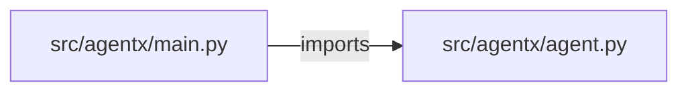

# sre-incident-investigator-agent — project architecture

[README](README.md) · [Interview questions and answers](INTERVIEW_QA.md)

## Purpose and scope

Alert → SRE agent → logs/metrics/git/k8s → previous incidents → RCA. Remediation needs human language avoided (page/reboot refused).

This document describes files and symbols in this checkout. Deployment templates and statements in the original overview are distinguished from a verified running environment.

## Component diagram



For Python repositories, arrows show resolved local imports, not network calls or deployment order. Otherwise the diagram is a repository component map; containment arrows do not assert runtime integration.

## Components and responsibilities

| Component | Responsibility |
| --- | --- |
| [`src/agentx/main.py`](src/agentx/main.py) | HTTP handlers: `GET /healthz`, `POST /agent/run` |
| [`src/agentx/agent.py`](src/agentx/agent.py) | Functions: `run` |
| [`requirements.txt`](requirements.txt) | Implementation or supporting configuration |
| [`tests/test_agent.py`](tests/test_agent.py) | Executable checks and regression examples |
| [`.github/workflows/ci.yml`](.github/workflows/ci.yml) | GitHub Actions job definitions |
| [`README.md`](README.md) | Project explanations or operating notes |

## Request interface

| Method and path | Handler | Source |
| --- | --- | --- |
| `GET /healthz` | `healthz` | [`src/agentx/main.py`](src/agentx/main.py#L6) |
| `POST /agent/run` | `post_run` | [`src/agentx/main.py`](src/agentx/main.py#L10) |

The table lists literal route decorators found in the inspected Python modules. Router prefixes and middleware can add behavior; check the linked handler and application setup before calling an endpoint.

## Implementation walkthrough

### `run(goal, payload)`

Source: [`src/agentx/agent.py`](src/agentx/agent.py#L4).

Calls visible in this function: `' '.join`, `' '.join(payload.get('facts') or []).lower`, `ValueError`, `any`, `goal.lower`, `payload.get`, `str`, `str(goal).strip`.

```python
def run(goal, payload):
    if not goal or not str(goal).strip():
        raise ValueError("goal is empty")
    low = goal.lower()
    if any(w in low for w in WRITES):
        return {"refused": True, "reason": "destructive action requires a human", "applied": False, "tools": []}
    facts = " ".join(payload.get("facts") or []).lower(); result = "bad_deploy" if "rollout" in facts else "saturation" if "cpu" in facts else "unknown"
    return {"refused": False, "tools": TOOLS, "rca": result, "applied": False, "needs_approval": False}
```

## Validation and failure paths

| Explicit exception | Source |
| --- | --- |
| `ValueError('goal is empty')` | [`src/agentx/agent.py`](src/agentx/agent.py#L6) |
| `HTTPException(422, str(exc))` | [`src/agentx/main.py`](src/agentx/main.py#L14) |

These are explicit exceptions in the inspected source, rather than a claim that every failure is handled. Follow the calling handler to see whether the exception becomes an HTTP response or propagates.

## Data and state

- [`src/agentx/agent.py`](src/agentx/agent.py) defines module-level containers: `TOOLS`.

Module-level dictionaries/lists live in a Python process. They can be fixtures or mutable state; inspect writes before treating them as persistent storage. A production extension would need to define persistence and concurrency behavior explicitly.

## Data flow and design decisions

### What is the input-to-output contract of `run`

In [`src/agentx/agent.py`](src/agentx/agent.py#L4), `run(goal, payload)` receives the inputs. The function computes these intermediate values:

- `low = goal.lower()`
- `facts = ' '.join(payload.get('facts') or []).lower()`
- `result = 'bad_deploy' if 'rollout' in facts else 'saturation' if 'cpu' in facts else 'unknown'`

Its result is defined by:

- `{'refused': False, 'tools': TOOLS, 'rca': result, 'applied': False, 'needs_approval': False}`
- `{'refused': True, 'reason': 'destructive action requires a human', 'applied': False, 'tools': []}`

### Which decision rules or boundary conditions should an interviewer challenge

The implementation in [`src/agentx/agent.py`](src/agentx/agent.py#L4) branches on:

- `not goal or not str(goal).strip()`
- `any((w in low for w in WRITES))`

A useful extension is a table-driven test that covers each condition just below, at, and above its boundary where applicable. These expressions are the current rules; changing them changes behavior and should be justified by the project’s acceptance criteria.

## Setup and verification

The following commands are derived from the checked-in dependency/test contracts. Execute them from the repository root; the block prepares a local environment, not a cloud deployment.

```bash
python3 -m venv .venv
source .venv/bin/activate
python -m pip install -r requirements.txt
python -m pytest -q
```

Python dependencies: [`requirements.txt`](requirements.txt).

Test entry points: [`tests/test_agent.py`](tests/test_agent.py).

Automation definitions: [`.github/workflows/ci.yml`](.github/workflows/ci.yml). Read their triggers and job steps to determine what CI actually runs.

## Operating boundaries and design review

Before turning this checkout into a customer deployment, establish the input contract, data ownership, access controls, failure response, evaluation criteria, and rollback owner. Repository fixtures and unit tests demonstrate local behavior; they do not establish throughput, uptime, compliance, or business impact.

A useful architecture review starts with the linked implementation: identify where input enters, where a decision is made, which state can change, and which external dependency can fail. Add a deployment view only for infrastructure that is actually configured and exercised.
